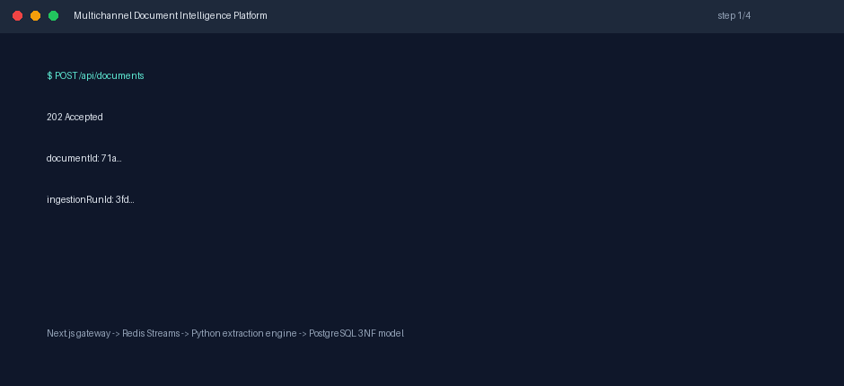
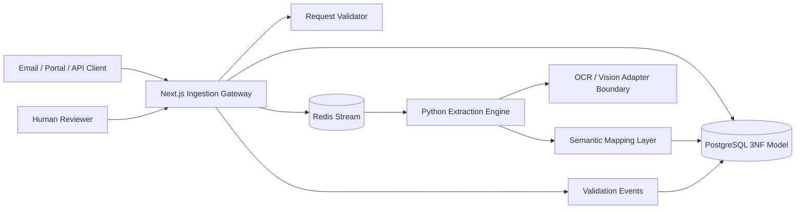

# Multichannel Document Intelligence Platform

[](https://github.com/Daniel5569/multichannel-document-intelligence-platform/actions/workflows/ci.yml)


[](https://vercel.com/new/clone?repository-url=https://github.com/Daniel5569/multichannel-document-intelligence-platform&root-directory=apps/web)

Production-shaped portfolio case study for AI-native companies that ingest contracts, claims, invoices, and dense PDF packets across email, portals, APIs, and back-office queues.

The system uses a bicephalous architecture:

- **Next.js / TypeScript** owns ingestion admission, API validation, relational metadata, and Redis Stream dispatch.
- **FastAPI / Python** owns extraction workers, OCR/Vision adapter boundaries, semantic mapping, and relational normalization.
- **Redis Streams** decouple gateway latency from CPU-heavy document extraction.
- **PostgreSQL** stores the canonical 3NF model, extraction evidence, and human validation events.
- **Docker Compose** runs the stack locally with internal service isolation.

## Why This Exists

Document AI fails in production when teams treat extraction as a single synchronous upload endpoint. Real workflows have bursty PDFs, late-arriving email attachments, inconsistent field names, schema drift, and human validation loops. The hard problem is not just OCR. It is turning unreliable unstructured evidence into relational data that finance, insurance, or legal teams can trust.

This case study solves that problem by splitting ingestion, extraction, normalization, and validation into independently observable stages.

## Demo



The demo shows the intended operator flow: submit a document packet, receive `202 Accepted`, enqueue extraction through Redis Streams, then persist normalized claim data and validation-ready evidence.

## Architecture



## Runtime Boundaries

```text
apps/web
  Next.js API gateway, document admission, Redis stream producer, relational status APIs

services/engine
  FastAPI internal service, Redis stream consumer group, extraction and 3NF mapping runtime

packages/shared
  Cross-runtime JSON contracts for ingestion payloads

infra
  PostgreSQL schema, sample extraction profiles, and Docker bootstrap assets
```

The gateway never blocks on extraction. It validates and stores metadata, writes an ingestion run, appends one Redis Stream event, and returns `202 Accepted`. Python workers consume the stream and update the relational model asynchronously.

## Asynchronous Flow

```text
1. A channel submits POST /api/documents with document metadata and text payload.
2. Node validates the payload, computes a SHA-256 content hash, and stores source metadata.
3. Node creates a document version and queued ingestion run in PostgreSQL.
4. Node appends a Redis Stream entry and returns 202 Accepted.
5. Python consumes the stream through XREADGROUP; stale pending messages are reclaimed with XCLAIM.
6. The extraction adapter produces typed evidence spans from the document text.
7. The mapper normalizes evidence into canonical parties, policy references, claim facts, and monetary values.
8. Python persists extracted entities and canonical claim rows in PostgreSQL.
9. Human reviewers can validate or reject mapped fields through the gateway.
10. The API exposes run status, evidence, and normalized relational data.
```

## Relational Model

The schema is intentionally normalized:

- `document_sources` separates channel identity from document records.
- `documents` stores stable document identity and lifecycle status.
- `document_versions` stores immutable payload versions and content hashes.
- `ingestion_runs` stores each extraction attempt independently.
- `extracted_entities` stores typed evidence spans linked to a run.
- `canonical_claims` stores normalized business facts linked to documents.
- `validation_events` stores reviewer decisions without mutating evidence history.

This avoids a flat "JSON blob table" while still preserving raw extraction evidence for audit and reprocessing.

## Performance Characteristics

These are local reference characteristics and test guardrails, not hosted production SLOs.

| Path | Methodology | Reference Result | Guardrail |
| --- | --- | --- | --- |
| Ingestion admission | Vitest validates payload, computes hash, mocks storage, and verifies Redis Stream append | local admission is bounded by Postgres insert plus Redis `XADD` | no synchronous Python call |
| Queue decoupling | Integration test uses real Postgres and Redis service containers | one queued run creates one stream entry | `202 Accepted` before extraction |
| Mapping correctness | Pytest maps deterministic evidence into canonical claim fields | required claim fields are normalized or marked missing | no silent partial success |
| Worker failure handling | Pytest injects malformed payloads, extraction failures, and stale pending messages | invalid jobs are dead-lettered, failed jobs are marked, stale work is XCLAIM-recovered | no unhandled promise/task loss |

## Design Decisions & Trade-Offs

| Decision | Benefit | Cost |
| --- | --- | --- |
| Redis Streams over HTTP callbacks | Stable cross-runtime async contract with consumer groups and XCLAIM recovery | Requires stream lag monitoring |
| PostgreSQL 3NF model over schemaless storage | Strong integrity and recruiter-visible data modeling | More schema design upfront |
| Python extraction engine | Strong OCR/NLP ecosystem and clean CPU-bound worker boundary | Two-runtime deployment complexity |
| Mock OCR adapter in public repo | Fully publishable with no paid API key | Production deployment needs real OCR provider adapter |
| Evidence-first validation events | Auditable review trail | More joins for UI queries |

## Prerequisites

- Node.js `>=20` (`.nvmrc` is included)
- Python `>=3.11`, developed with `3.12` (`.python-version` is included)
- Docker Engine `>=24`
- Docker Compose v2
- GitHub CLI `gh` for publication automation

Dependency note: the web app is temporarily pinned to `next@16.3.0-canary.43` / `eslint-config-next@16.3.0-canary.43`. On 2026-06-12, the latest stable `16.2.9` still triggers the nested PostCSS audit advisory, while this canary keeps `npm audit --audit-level=moderate` clean. Move back to stable as soon as the patched stable dependency path ships.

## Quick Start

```bash
cp .env.example .env
docker compose up --build
```

Gateway:

```text
http://localhost:3000
```

Only the Next.js gateway exposes a host port. PostgreSQL, Redis, and the Python engine are reachable only inside the Docker internal network.

Submit a document:

```bash
curl -X POST http://localhost:3000/api/documents \
  -H "content-type: application/json" \
  -d '{
    "channel": "email",
    "externalRef": "claim-email-1042",
    "filename": "claim-packet.txt",
    "mimeType": "text/plain",
    "contentByteSize": 117,
    "contentText": "Claim Number: CLM-2026-1042\nPolicy Number: POL-88A\nClaimant: Ada Morgan\nLoss Date: 2026-05-17\nClaim Amount: $12840.50",
    "extractionProfile": "claims"
  }'
```

## Testing

Whole-repo check:

```bash
npm run check
```

Node gateway:

```bash
cd apps/web
npm ci
npm test
npm run build
npm run audit
```

Python engine:

```bash
cd services/engine
python -m pip install -e ".[dev]"
python -m pytest
python -m ruff check .
python -m black --check .
```

GitHub Actions runs unit tests, a Postgres/Redis integration test, audit, and the Next.js production build.

## Production Safety

Local `.env` files are ignored; commit only `.env.example`. The gateway and engine allow `change-me-in-production` defaults only when `APP_ENV=development` or `ALLOW_INSECURE_DEV_DEFAULTS=1` is set. In production runtime, missing Redis configuration or default database credentials fail closed.

The public ingestion boundary validates allowed mime types, optional byte size, and optional SHA-256 checksum before enqueueing. Unsupported extraction profiles fail closed in the worker.

## What Is Real Vs Demo

- Real: async admission API, normalized PostgreSQL records, Redis Streams with dead-letter/XCLAIM recovery, deterministic extraction fixtures, and human-review status modeling.
- Demo-shaped: OCR and file storage are dependency-light public mocks. Production should add object storage uploads, OCR provider adapters, reviewer APIs, and lag/error dashboards.

## Known Limitations / Roadmap

- The OCR/Vision adapter is deterministic and mockable for public review; production would plug in Textract, Azure Document Intelligence, Tesseract, or a multimodal model.
- Document upload uses text payloads in the public demo to keep the repository dependency-light; the architecture boundary supports object storage uploads.
- Stream retry, XCLAIM pending recovery, and dead-letter behavior are implemented; production should add lag dashboards and alerting.
- Human validation APIs are represented at the schema level; a richer reviewer UI would be the next product layer.

## Context

Document AI is an infrastructure problem, not a prompt demo. This system shows asynchronous queueing, typed extraction evidence, normalized relational modeling, worker failure handling, and CI-backed reproducibility in one inspectable monorepo.
